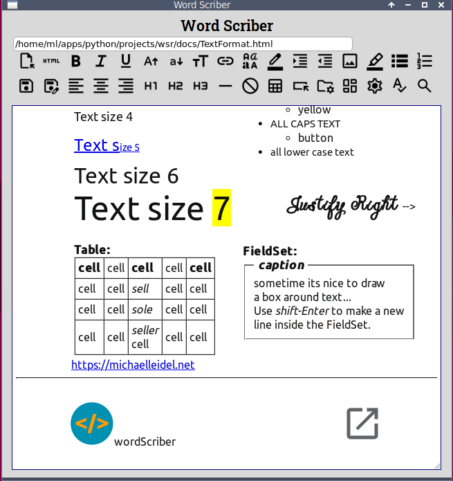

# wordScriber

__HTML local document editor__  
Linux version

WordScriber is a _simple_ offline HTML document editor.
There is probably no great use for it as an application;
however, it does domonstrate how to create apps that 
combine a python/tkinter module and an HTML GUI 
in an offline desktop situation. In other words
Python manages local resources while HTML manages
the user interface.

To accomplish this the ___pywebview___ python module provides 
communication between __Python/tkinter__ and __HTML/Javascript__.

There are certain limitations depending on the web engine
and API employed. Web engines used outside of an Internet 
browser may be missing features found in the browser versions.
For Linux _pywebview_ uses __WebKitGTK__ to render HTML in a
an HTML _contentEditable_ block.

In __WebKitGTK__ spell checking is absent. 
In the Windows version of wordScriber _pywebview_
uses __WebView2__ (part of _Edge_) which does provide
spell checking in a limited way. 



Python 3.x  and a few other things must be installed:

```bash
sudo apt install python3   
sudo apt install python3-tk
sudo apt install python3-pip
sudo apt install python3-pil.imagetk
pip install pywebview
pip install spellchecker
```

Before using wsr.pyw open the options.dat file with a text editor (default: Mousepad) 
and review the initial settings. In particular make sure the text editor 
and file manager are items installed on your system. The Linux file manager is 
called Thunar, caja, Nemo, or Nautilus which ever you use.

## Run the App:

`c:\wsr\python3 wsr.py`

Often you will need to select the text that you want to apply formatting to.

Hot Keys
```bash
Ctrl-h ... Help
Ctrl-s ... Quick Save
Ctrl-q ... Quit
Ctrl-c ... Copy selected text to clipboard
Ctrl-v ... Paste from clipboard
Ctrl-e ... Edit Options.dat file 
Ctrl-z ... Undo
Ctrl-t ... Redo
Ctrl-m ... Launch File Manager
Ctrl-i ... Italic 
Ctrl-b ... Bold
Ctrl-f ... Find Text
Ctrl-ESC.. Clear Found
Alt-i  ... Indent
Alt-o  ... Outdent
Alt-u  ... UPPERCASE selected
Alt-l  ... lowercase selected
```
WordScriber does not have a "Replace" function.
Once Word Scriber is installed it will not require an Internet connection.      

## File and Graphics

Files can be opened and stored anywhere. The default location for files in in 
the application directory in a folder called "docs". Graphic file must be stored 
in or under the application directory. An "images" folder is provided by the installation. 
There is a button that will open your systems file manager to the applications directory.

## HTML

The HTML is 'roughly' formated so at least it is readable.
The ___document.execCommand()___ function is no longer supported 
for relevant web standards but will
probably be kept for compatibility purposes. 
There is no adequate replacement for it, in my opinion, that works
as smoothly. 

In _wordScriber_ I've used a Javascript function
called _insertHTML_ which replaces the execCommand("insertHTML") function
and enabled me to write Javascript functions for _table_ and _fieldset_ as well.

## Options file

The options.dat file in the application's directory contains settings important 
to initialization of the app on startup. 

font  
like Arial or DejaVu Serif

font size  
_like 11pt_

font color  
\#000 or black

text line height  
_like 125%_

background color of app  
like \#ADD8E6 or lightblue

background color of editing area  
_like #fff or white_

text editor  
name of a text editor installed on your system
Its only use at this time is to open the options.dat file
_like gedit or mousepad or sublime or ..._

file manager  
name of a file manager install on your system
It will help with document and graphic management
_like thunar or caja or nautilus or ..._
